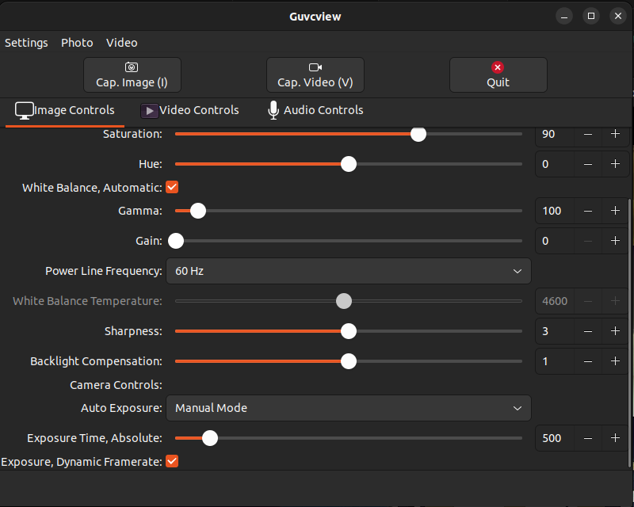

# Timing Testing

This repo contains basic testing and docs for using the external trigger feature on our usb cam. It follows the arducam docs:
https://www.arducam.com/100fps-global-shutter-color-usb-camera-board-1mp-ov9782-uvc-webcam-module-with-low-distortion-m12-lens-without-microphones-for-computer-laptop-android-device-and-raspberry-pi-arducam.html

Wonderfully, NVidia made the GPIO pins input-only, which is no good for our external triggering pins. I followed this guide to fix that:
https://jetsonhacks.com/2025/04/07/device-tree-overlays-on-jetson-scary-but-fun/

Here's the linked repo with the fix:
https://github.com/jetsonhacks/jetson-orin-gpio-patch

To minimize additional work, I'm using the example and changing pin 7 to be bidirectional only. See the pinout here: https://jetsonhacks.com/nvidia-jetson-orin-nano-gpio-header-pinout/

The guide from jetsonhacks had some outdated stuff with the jetson GPIO library, so I followed this to make sure the version was correct:
https://github.com/ValidusGroup-Design/jetson-orin-io-tools/blob/main/jetson_gpio_guide.md

After all that, it works!!!

# Configuring camera for external trigger
Arducam hijacks the standard v4l2 controls to enable the external trigger mode. Refer to the docs for more details, but in short:
- Set exposure to manual - in the v4l2 controls, this means 1.
- Set the exposure time to 500ms - this can be configured as needed but must be fast enough to fit between the trigger pulses
- turn on "exposure_dynamic_framerate" (=1 in manual controls) - this encodes the global trigger functionality

For testing, I used `guvcview` which was very handy. The controls to set can be seen in the bottom 3 lines of this image:

Now, if you run [rolling_trigger.py](rolling_trigger.py), it will pulse the external trigger at 30fps and appear as video!!